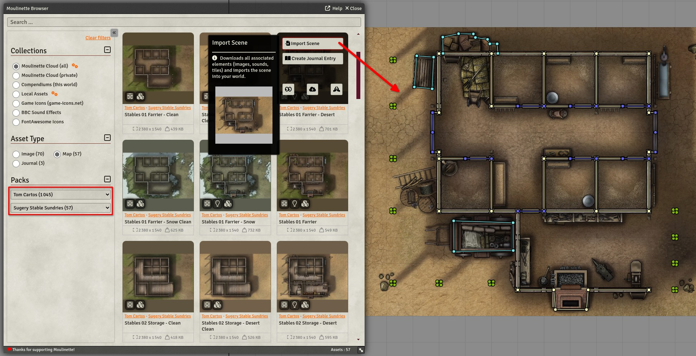
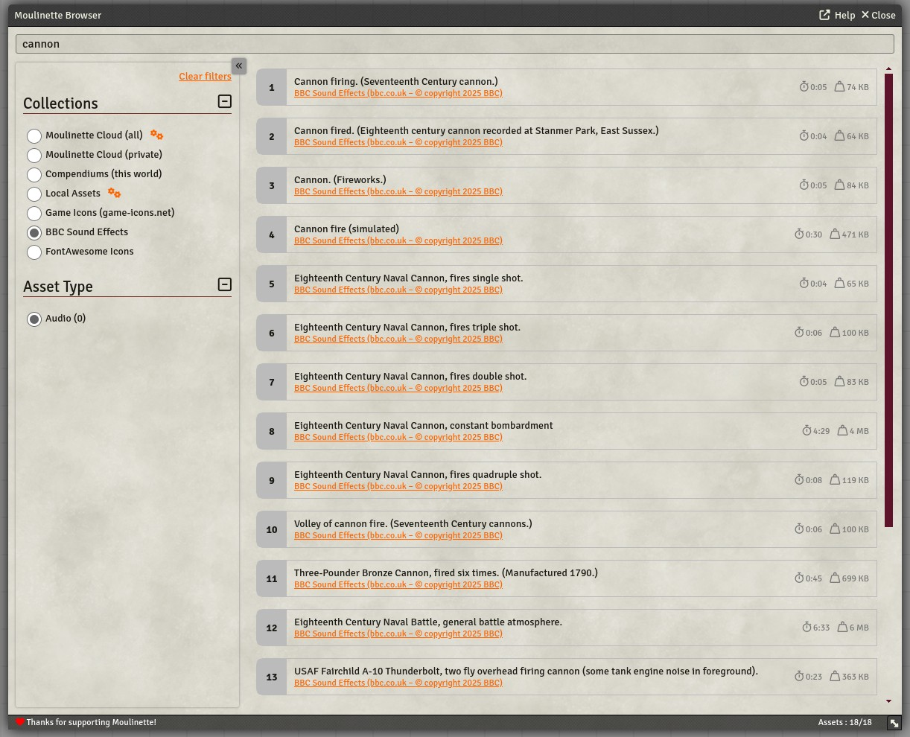

# Moulinette TTRPG Media Search (FoundryVTT module)

This module is part of the [Moulinette suite](https://www.moulinette.cloud) of tools designed to simplify the search and use of [TTRPG](https://en.wikipedia.org/wiki/Tabletop_role-playing_game) content for game masters, helping them prepare their game sessions and even manage their games in real time.

The module is designed for [FoundryVTT](https://foundryvtt.com/). Quickly and easily search through your own content (indexed by Moulinette) or the content from creators you support.

#### Features
* Browse, search, download, and import directly from [Moulinette Cloud](https://assets.moulinette.cloud/marketplace/creators). (1)
* Browse, search and import from your world's **compendiums**.
* Browse, search, and import from your **locally stored assets** with ease.
* Search, download and use icons from [Game-icons.net](https://gameicons.net)
* Search, download and use sound effects from [BBC Sounds Effects](https://sound-effects.bbcrewind.co.uk/) for non-commercial use (see [Licensing](https://sound-effects.bbcrewind.co.uk/licensing)).
* Search and select icons from the [Font Awesome](https://fontawesome.com/) collection, pre-installed in FoundryVTT.

*(1) : Accessing content from creators requires supporting both them and Moulinette. The usage rights for the content are specific to each creator.*

  

## <a name=""/>Screenshots

  
 
  

## <a name="install"/>Install the module

**Installing** the Module from FoundryVTT

1. Launch Foundry VTT and navigate to the "Add-on Modules" tab in the Setup menu.
2. Search for "Moulinette Media Search" in the list and click Install.

**Manual Installation** (Not Recommended)

1. Launch Foundry VTT and navigate to the "Add-on Modules" tab in the Setup menu.
2. Click the "Install Module" button and enter the following URL as "Manifest URL":

`https://github.com/SvenWerlen/moulinette-foundryvtt-module/releases/latest/download/module.json`

3. Click Install and wait for the process to complete.

## <a name="support"/>Support me on Patreon

If you like my work and want to support me, consider subscribing to Moulinette!
* [Moulinette on Patreon](https://www.patreon.com/moulinette)
* [Moulinette on Stripe](https://assets.moulinette.cloud/pricing) (requires Patreon authentication)

You can also join [Moulinette Discord](https://discord.gg/xg3dcMQfP2)
